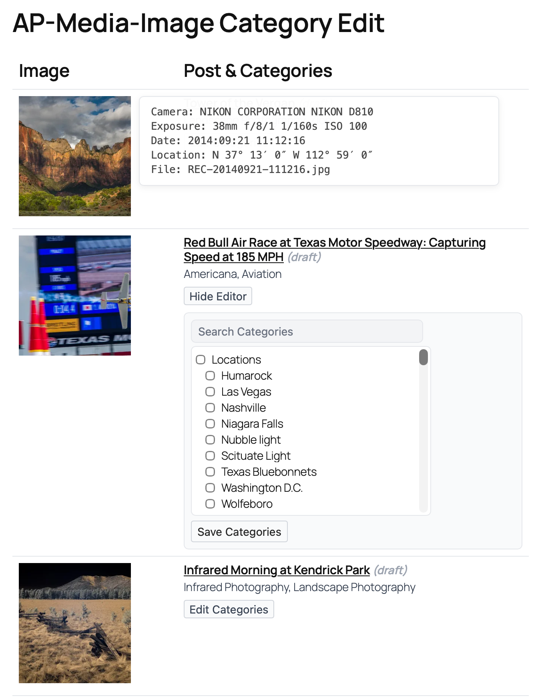

# AP Media Image List

A lightweight WordPress plugin that lists **all image attachments** in a table—one image per row—with:

- **Thumbnail with EXIF popup** (camera, lens, exposure, GPS, date) extracted from original uploaded files - click to pin/unpin (column 1)
- **Parent post title with preview** + categories with inline **category editor** accessible via "Edit Categories" button (column 2)

It works with **draft/private** posts and includes capability checks so only authorized users can modify categories.

> **Shortcode:** `[media_image_list]`

---

## Features

- Displays every image in the Media Library (paginated)
- **EXIF metadata display:**
  - Extracted from **original uploaded files** (not resized thumbnails)
  - Hover or click thumbnails to view camera info, lens, exposure settings, GPS location, and capture date
  - Click-to-pin/unpin functionality with improved toggle behavior
  - Toggle between human-readable format or raw JSON via shortcode attribute
- **Inline post preview:**
  - Click post titles to open full content in a modal overlay
  - Scrollable content area for long posts
  - Respects WordPress permissions and post visibility
  - Multiple ways to close (×, overlay click, Escape key)
- Shows **draft**/**private** parent posts too
- **Inline AJAX-powered category editor** with no page reload:
  - Compact 2-column layout with expandable editor via "Edit Categories" button
  - Categories display updates automatically after saving
  - Save categories without losing your place in the list
  - Real-time feedback ("Saving...", "Saved!")
  - Search box + clear "×"
  - Tri-state parents (indeterminate when some children selected)
  - **No auto-select** of parent when selecting a child
  - Native **tooltips** on hover for long names
  - Non-wrapping labels with **ellipsis**
  - Root categories have **no left indent**
  - Stable width while filtering (`scrollbar-gutter: stable`)
- Capability-aware (respects taxonomy `assign_terms` and `edit_post`)
- Minimal CSS, inherits WP font sizes (uses `--wp--preset--font-size--small`)
- No admin pages—just drop in the shortcode on any page

---

## Requirements

- WordPress **5.9+** (tested up to latest)
- PHP **7.4+**
- A theme that loads WP preset font variables (most do; graceful fallback is provided)

---

## Installation

1. Copy `ap-media-image-list.php` into `/wp-content/plugins/ap-media-image-list/`
2. Activate **AP Media Image List** from *Plugins → Installed Plugins*
3. Create a **draft** page (recommended) and add the shortcode:

```
[media_image_list]
```

Open the page (or preview) to use the tool.

> **Tip:** Using a draft/private page keeps the tool hidden from visitors.

---

## Shortcode Attributes

| Attribute | Type | Default | Notes |
|-----------|------|---------|-------|
| `per_page` | int | `50` | Items per page (pagination enabled when needed). |
| `page_var` | string | `mit_page` | URL query var for pagination. |
| `include_unattached` | bool | `true` | Show images with no parent post. |
| `orderby` | string | `date` | Any valid `WP_Query` orderby for attachments. |
| `order` | `ASC` / `DESC` | `DESC` | Sort direction. |
| `size` | string | `thumbnail` | Image display size: `thumbnail` (140×140 cropped), `small` or `medium` (140×140 contained), `large` or `full` (300×300 contained). |
| `show_editor` | bool | `true` | Display category edit tool. Set to `false` for read-only inventory/printing. |
| `metadata_display` | `basic` / `json` | `basic` | EXIF display format: `basic` (human-readable) or `json` (raw data dump). |

### Examples

```
[media_image_list per_page="100" orderby="title" order="ASC" size="large"]
[media_image_list include_unattached="false"]
[media_image_list show_editor="false"]
[media_image_list metadata_display="json"]
```

---

## Image Sizing

The plugin offers three distinct image display modes optimized for different use cases:

### Thumbnail (`size="thumbnail"`)
- **Dimensions:** 140×140px (cropped square)
- **Behavior:** Crops images to fill the entire square area
- **Use case:** Uniform grid appearance, consistent layout
- **Best for:** Quick browsing, catalog views

### Small (`size="small"` or `size="medium"`)  
- **Dimensions:** 140×140px (contained)
- **Behavior:** Shows complete image within bounds, maintains aspect ratio
- **Use case:** Compact viewing while seeing the entire image
- **Best for:** Detail verification, composition review

### Large (`size="large"` or `size="full"`)
- **Dimensions:** 300×300px (contained)
- **Behavior:** Shows complete image within bounds, maintains aspect ratio  
- **Use case:** Detailed examination, quality assessment
- **Best for:** Photo editing decisions, detailed inspection

All sizes maintain proper aspect ratios and prevent image distortion or elongation.

---

## Post Preview

Click any post title to open an inline preview modal without leaving the media list:

### 🖼️ **Modal Features**
- **Full post content** - Complete formatted content with shortcodes processed
- **Responsive design** - Works on desktop, tablet, and mobile devices
- **Scrollable content** - Handle long posts with vertical scrolling
- **Post metadata** - Shows publish date, author, and draft status
- **Secure access** - Respects WordPress permissions and post visibility

### 🎮 **Interaction**
- **Click post title** → Opens preview modal
- **"×" close button** → Dismisses the preview
- **Click overlay background** → Closes modal
- **Press Escape key** → Keyboard shortcut to close
- **No page navigation** → Stay in your current position in the media list

### 📱 **Responsive Behavior**
- **Desktop:** 800px wide modal with comfortable reading width
- **Mobile:** Full-width modal with proper touch interactions
- **Tablet:** Optimized sizing for tablet viewing

---

## EXIF Metadata

The plugin extracts EXIF data from the **original uploaded image file** (not WordPress-generated thumbnails, which strip metadata). The popup displays:

- **Camera:** Make and model
- **Lens:** Lens make and model (if available)
- **Exposure:** Focal length, aperture (f-stop), shutter speed, ISO
- **Date:** Original capture date/time
- **Location:** GPS coordinates in degrees/minutes/seconds format (if available)
- **File:** Original filename

### Interaction

- **Hover** over any thumbnail to see the EXIF popup
- **Click** a thumbnail to pin/unpin the popup (toggles between locked and hover modes)
- **Click elsewhere** to close all pinned popups
- **Click different image** automatically switches the pin to that image
- Set `metadata_display="json"` to see raw EXIF array for debugging

---

## Permissions & Security

- The editor column appears only for logged-in users with:
  - `edit_post` on the parent post **and**
  - the taxonomy's `assign_terms` capability (for `category` this is usually `edit_posts`).
- All requests are validated with nonces and WordPress capabilities
- Category updates use `wp_set_post_terms()` with proper sanitization

If you're logged in but still see a warning, ensure your account has the correct role/capabilities and that the post type actually supports the **category** taxonomy.

---

## Category Editor UX

- **AJAX save:** No page reload—you stay exactly where you are in the list
- **Real-time feedback:** "Saving..." → "Saved!" appears next to the button
- **Search** filters the tree to show matching terms **and their ancestors**
- **Clear "×"** button resets the filter
- **Tri-state parents:** parents become *indeterminate* when some (not all) children are selected
- **Child clicks don't check the parent** automatically
- **No-wrap labels** with ellipsis keep rows compact
- **Tooltips** on hover show the full category name
- Root lists have **no left padding**; nested lists indent by 12px
- The panel keeps a **stable width** while filtering (no jumping)

---

## Screenshots

*The following screenshots show the plugin in action using this shortcode:*

```
[media_image_table 
    per_page="25" 
    size="thumbnail" 
    editor_ui="dropdown" 
    metadata_display="basic"
]
```

### Media list table with EXIF popups


### Category editor with AJAX save


---

## Customization

Small CSS hooks you might override in your theme or a Customizer snippet:

```css
/* Customize the Edit Categories button */
.mit-edit-categories-btn { 
  background: #0073aa; 
  color: white; 
  border-radius: 4px; 
}

/* Tweak editor max-height */
.ap-cat-tree { max-height: 260px; }

/* Adjust nested indent */
.ap-cat-tree ul ul { padding-left: 16px; }

/* Customize EXIF popup */
.mit-exif-block { 
  min-width: 500px; 
  font-size: 14px;
}
```

> The plugin intentionally uses light, scoped CSS and WP presets to minimize conflicts.

---

## How it Works (Tech Notes)

- Lists image attachments via `WP_Query` (`post_type=attachment`, `post_mime_type=image`)
- For each image:
  - Renders the thumbnail with clickable EXIF popup
  - Extracts EXIF from original file using `wp_read_image_metadata()` or `exif_read_data()`
  - Finds the **parent post** (if any), renders its title (linked). Drafts use a preview link
  - Shows current `category` terms
  - Outputs a compact form with hierarchical checkbox tree
- **AJAX save:** JavaScript intercepts form submission, sends data via `fetch()` to WordPress AJAX endpoint
- Server validates nonce and capabilities, updates categories with `wp_set_post_terms()`, returns JSON response
- No page reload—user stays at their current scroll position

---

## Development

- Single-file plugin: `ap-media-image-list.php`
- Main class: `AP_Media_Image_List`
- Hooks used:
  - `add_shortcode( 'media_image_list', ... )`
  - `wp_enqueue_scripts` for inline CSS/JS
  - `wp_ajax_ap_mit_save_categories` and `wp_ajax_nopriv_ap_mit_save_categories` for AJAX handling
- Text domain: `ap-media-image-list`

### Local Setup

1. Drop the file into `wp-content/plugins/ap-media-image-list/`
2. Activate the plugin
3. Create/preview a page with `[media_image_list]`

### Coding Style

- Follows WordPress PHP coding standards
- Escape everything (`esc_html`, `esc_attr`, `esc_url`) and validate with `wp_verify_nonce` & `current_user_can`
- AJAX responses use `wp_send_json_success()` and `wp_send_json_error()`

---

## Known Limitations

- Only manages the **default `category`** taxonomy. If your post type uses a custom taxonomy, this build won't edit it (roadmap item)
- EXIF data only available if present in original upload—WordPress doesn't generate it
- Large taxonomies (thousands of terms) will render, but filtering may feel slower in very old browsers
- The editor UI is available **per image's parent post**, not for unattached media

---

## Roadmap

- [ ] Support custom taxonomies via shortcode attribute (e.g., `taxonomy="topic"`)
- [ ] Bulk actions (apply selected categories to multiple images)
- [ ] Keyboard navigation (↑/↓ to focus, space to toggle)
- [ ] Optional "Select all children" affordance on parent hover
- [ ] Custom EXIF field selection
- [ ] Export to CSV with EXIF data

---

## Changelog

### 1.6.2
- **New post preview feature:** Click post titles to view full content in modal overlay
- Modal includes scrollable content, post metadata, and multiple close options
- Respects WordPress permissions and handles draft/private posts
- **Enhanced EXIF popup interaction:** Improved click-to-pin/unpin toggle behavior
- Fixed EXIF popup locking mechanism - now properly toggles on/off
- Better event handling to prevent conflicts between features
- Added keyboard support (Escape key) and improved mobile interaction

### 1.6.1
- **Enhanced image sizing system:** Three distinct size modes with proper constraints
- `thumbnail` (140×140 cropped) - uniform squares for consistent layout
- `small`/`medium` (140×140 contained) - complete images in compact space
- `large`/`full` (300×300 contained) - detailed viewing with larger display
- Fixed image elongation issues - all images maintain proper aspect ratios
- Dynamic column width adjustment based on selected image size
- Improved CSS specificity to override WordPress inline styles

### 1.6.0
- **Major UI improvement:** Compact 2-column layout with inline category editor
- Removed third column - category editor now appears inline within the second column
- Added "Edit Categories" button that shows/hides the editor on demand
- Category display updates automatically after saving changes
- Only one editor can be open at a time for cleaner interface
- Improved mobile responsiveness with reduced table width

### 1.5.4
- AJAX category save (no page reload)
- EXIF metadata extraction from original files
- Clickable/pinnable EXIF popups
- `metadata_display` attribute for JSON view

### 1.5.3
- Added `show_editor` attribute; when `false` removes the category edit column for inventory/printing

### 1.5.2
- No-wrap labels with ellipsis
- Hover tooltips
- Stable width while filtering
- Minor style polish

### 1.5.1
- Fixed filename rendering
- Widened editor column

### 1.5.0
- Renamed to *AP Media Image List*
- No root indent
- Child click no longer auto-checks parent

### 1.4.x
- Category editor with search + tri-state
- Login/permission warnings
- Support for drafts/private posts
- Compact styles

---

## Contributing

PRs welcome! Please:

1. Follow WP coding standards
2. Keep CSS footprint minimal and scoped
3. Test with drafts/private posts and on a non-admin account
4. Test AJAX functionality and EXIF extraction with various image formats
5. Update this `README.md` and bump the version header

---

## License

MIT © AlwaysPhotographing

---

## Support

Open an issue on GitHub with:
- WordPress & PHP versions
- Theme name
- Browser and version
- A screenshot of the problem
- Console errors (if any)
- Sample EXIF data (if metadata-related)

---

## Show Your Support

If this plugin helps you manage your WordPress media library, please give it a star!